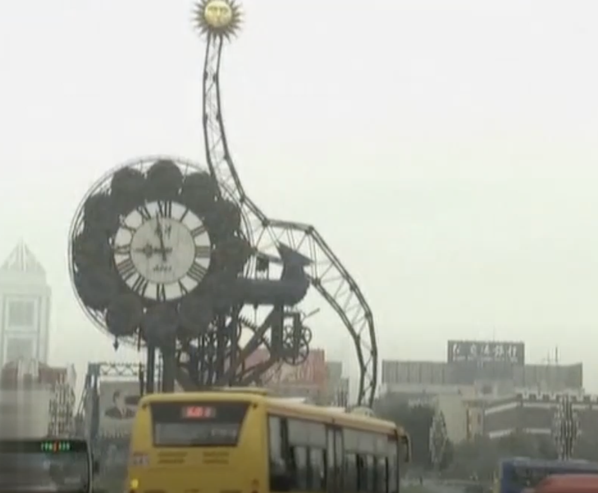
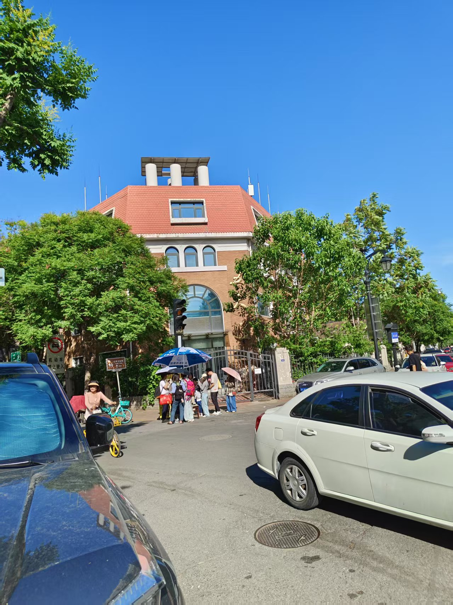
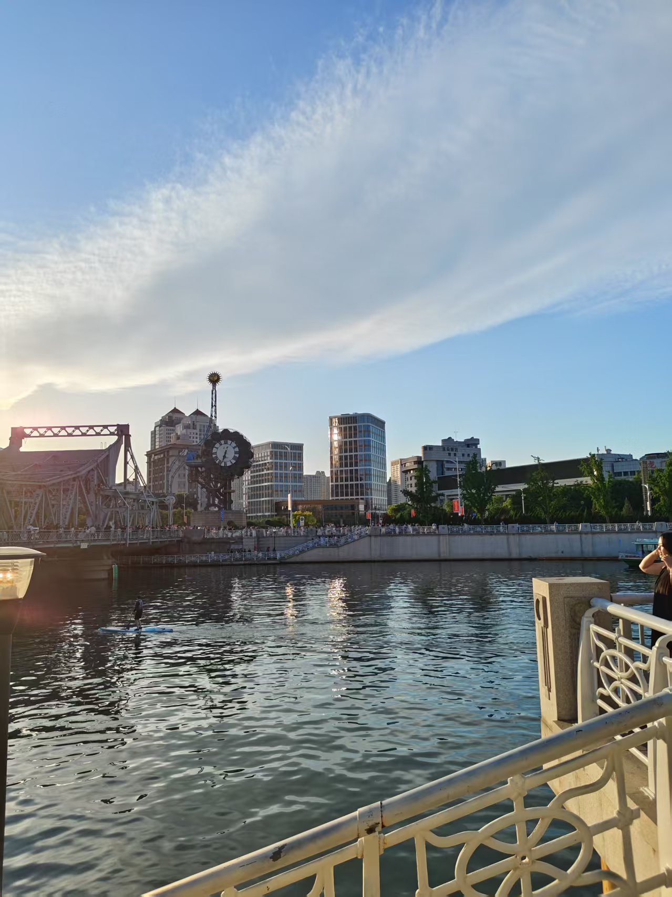

# 天津印象

## 天津卫视
最早是从电视喜剧《杨光的快乐生活》了解天津这个城市的，那是2006年，2007年的样子。古老的卫星电视上能收到各地的电视频道，其中就有天津卫视。当时的天津卫视使用的还是旧的logo。
 
天津卫视logo(旧)

这部喜剧就是在夜晚的黄金时段播出。由杨少华、杨议等演员主演，故事取材自天津市普通百姓的日常生活，呈现了一系列充满幽默与“弄巧成拙”情节的故事。近期又重温了一遍，里面的很多桥段还留有印象。据了解，剧中的主要取景地集中在天津的五大道，其中也不乏出现了天津的地标性建筑世纪钟。时过境迁，事物的面貌已发生了显著变化。

电视喜剧《杨光的快乐生活》中的世纪钟

## 如期而至
2024年5月末，我有幸与朋友约定一起到天津游玩。从北京南站出发，到天津南站的旅程大约持续了三十分钟，出入站非常便捷。我早就听说有人在天津居住，却需要往返北京上班，便捷的交通条件让天津和北京之间的跨城通勤成为可能。

天津的地铁需要下载专门的APP才能扫码使用。由于朋友当天需要参加软考，我们约定在其考试的大学见面。虽然本来打算下次再见，但在我的坚持下，我们如期而至，同时也给了我充足的时间来做好见面准备。

考试12点30分结束，我本以为要等到考试结束的时间，没想到朋友提前交卷，在接近12点的时候就见到了彼此，心花怒放。临近中午，就在学校解决的午饭，可能因为工作了的缘故，这所大学的食堂给我的印象可以说是物美价廉。吃完饭与朋友聊天，了解到学校在疫情过后很快就允许校外人员进入了，我之前还担心能否顺利进入学校，看来是我多虑了。不由得感叹大城市的校园果然更开放，包容性更强，当我说包容性更强的时候，隐约间感到朋友好像面露不悦，但并没有说明具体原因。而我想说的是这所学校很棒，比我就读的学校在各方面都先进许多，没有任何讽刺，贬低的意思。  

在学校里便能看到天津高银金融117大厦烂尾楼，朋友说他读大学时什么样，硕士毕业时还什么样，没有一丝改变。

## 五大道
紧接着，与朋友一同乘坐地铁去五大道游玩，五大道共由成都道、重庆道、常德道、大理道、睦南道及马场道六条街道形成，拥有各种花园房屋2000多所，名人旧居近40所。是民国时期社会各界知名人士汇集的住宅区。由于没有做功课，不甚了解，便只是走马观花的游览了一些区域。令人印象深刻的则是民园广场，小白楼等区域。在五大道中见到了许多有趣的事物，例如由电力驱动的马车，朋友打趣道：他们这个行业也要降本增效。还有很戏剧性的一幕是五大三粗的大哥，操着一口标准的天津口音说出“煎饼果子“四个字。

五大道入口

## 世纪钟
在五大道游玩了一段时间后，到了晚饭时间，朋友说这个时间点天津菜都需要排队，因此决定去一家朋友吃过的砂锅店吃晚饭，距离并不算远，于是决定步行前往，并在中途经过了天主教西开总堂，在教堂门口给朋友拍照被吐槽拍的好烂，有一说一拍的确实很烂，是该练习一下摄影技术。到了餐馆吃饭是朋友买的单，约定等朋友到北京来玩，由我买单。

吃完饭时间还早，一同前往了津湾广场，见到了天津的地标性建筑-世纪钟，以及汇入渤海的河流-海河。时间正处五月末的傍晚，夕阳西下，金色的阳光洒在静静流淌的河流上，波光粼粼，美不胜收。河边有许多小摊，人们闲庭信步，充满了松弛感。更巧是的碰到了由歌迷自发组织的张杰的歌友会。

一路从世纪钟转悠到了北安桥，在金街坐上了地铁，前往天津南站，有意思的是在和平路换乘需要站外换乘，换乘时还与朋友讨论是否会重新计费，事实上并没有重新计费，然而却要再次安检，朋友吐槽到：今天经过了无数次安检。到了车站便迎来了分别，充满了不舍。

世纪钟-2024年5月

## 总结
我对天津的印象很好，确实是受到朋友的影响。很多时候一个人就影响了你对他所在城市的印象，当然这是片面的。希望有机会能再次到天津游玩，祝愿朋友健康、快乐、幸福、万事顺遂。

